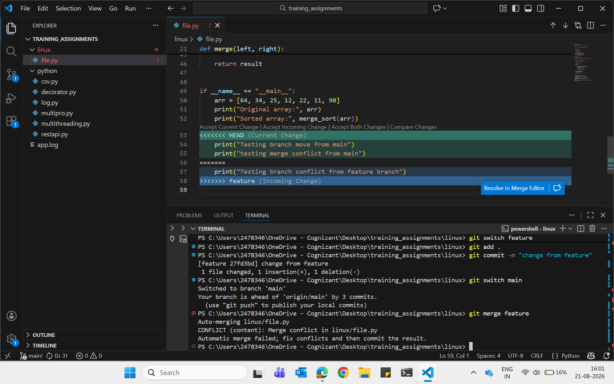
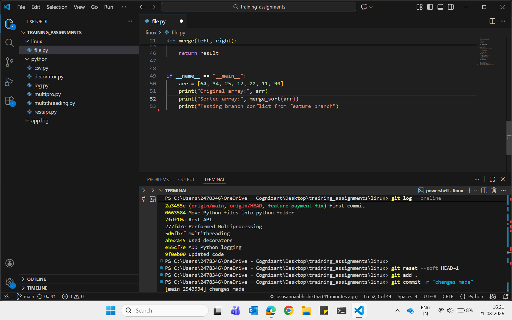
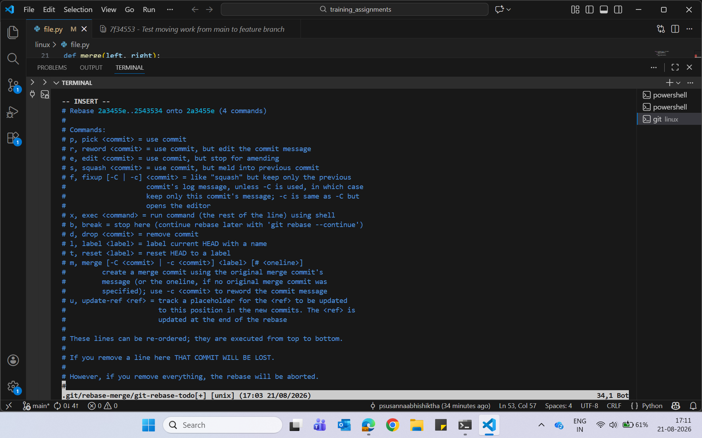
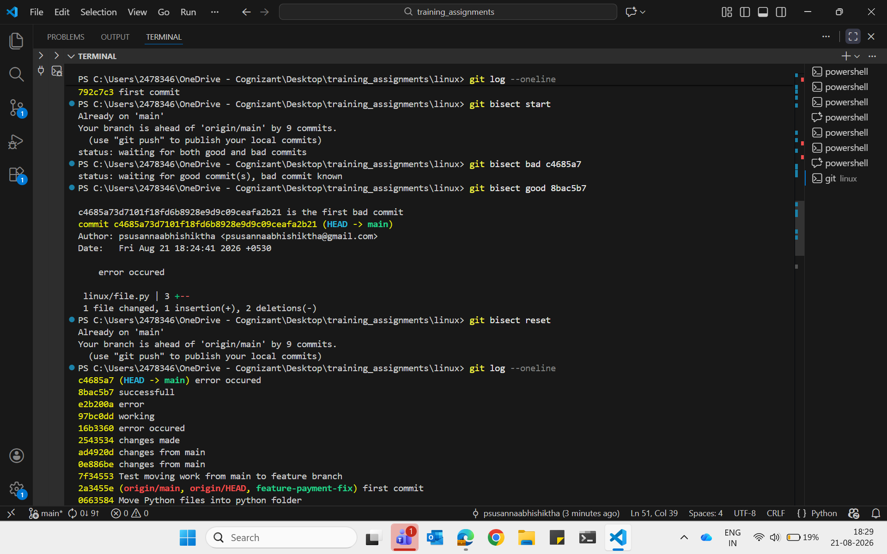
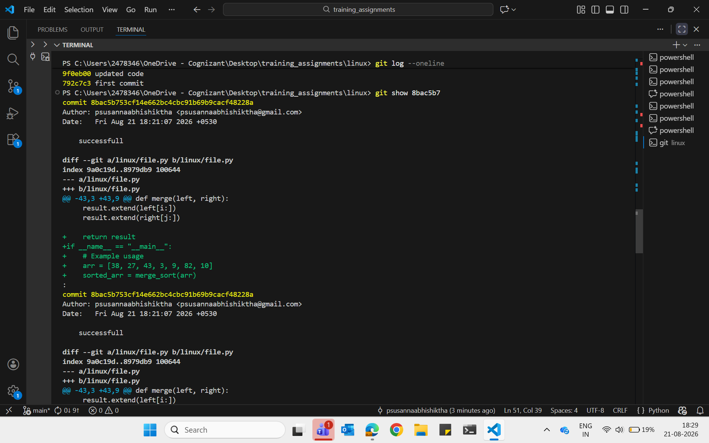
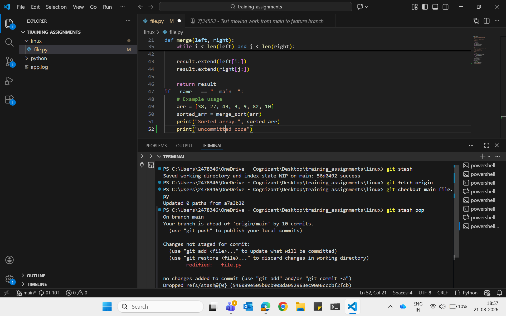

# Question-1
You accidentally made changes on `main` instead of a feature branch. What steps would you take to move the work safely?​

## Solution:
### if no commit done on main
1. Check the current status
2. Create a new feature branch
3. Switch to the feature branch
4. Stage the changes and commit it
6. Verify the branch
### if commit done on main
reset main to the previous commit

### Proof of work:
git/GIT_Q1.png

# Question-2
You pulled the latest code and got a merge conflict. How would you inspect and resolve it?​

## Solution:
1. Pull the latest code
2. Check the conflicted files using git status
3. Open the file and inspect conflict markers
4. Resolve the conflict by choosing the correct changes
5. Stage the resolved file using git add
6. Commit the resolution using git commit

## proof of work

# Question-3:
Your last commit contains a secret in a config file. What would you do if it has not been pushed yet? What changes if it has already been pushed?​

## Solution:
1. Check the commit history
2. Undo the last commit
3. Remove the secret from the config file
4. Stage the corrected file

## proof of work

# Question-4
A pull request has unrelated commits mixed together. How would you clean it before asking for review?​

## Solution:
1. Check the commit history
2. Start an rebase for the unrelated commits
3. Save and complete the rebase
4. Verify the cleaned history
5. Update the branch

## proof of work

# Question-5
 test started failing sometime last week. How would you use Git to identify which commit introduced the issue?​

 ## Solution:
 1. Start bisect mode
 2. Mark the current failing commit as bad
 3. Mark a known working commit as good
 4. Repeat until Git identifies the commit that introduced the issue
 5. View the details of the identified commit
 6. Exit bisect mode

 ## proof of work
 
 

 # Question-6
 Your branch is behind remote and has local changes. How would you update safely without losing work?​

 ## Solution
 1. Save the local changes temporarily
 2. tch the latest changes from the remote repository
 3. Update the local branch with the remote changes
 4. Reapply the saved local changes
 5. Resolve any conflicts if they occur
 6. Verify the status of the branch

 ## proof of work
 
