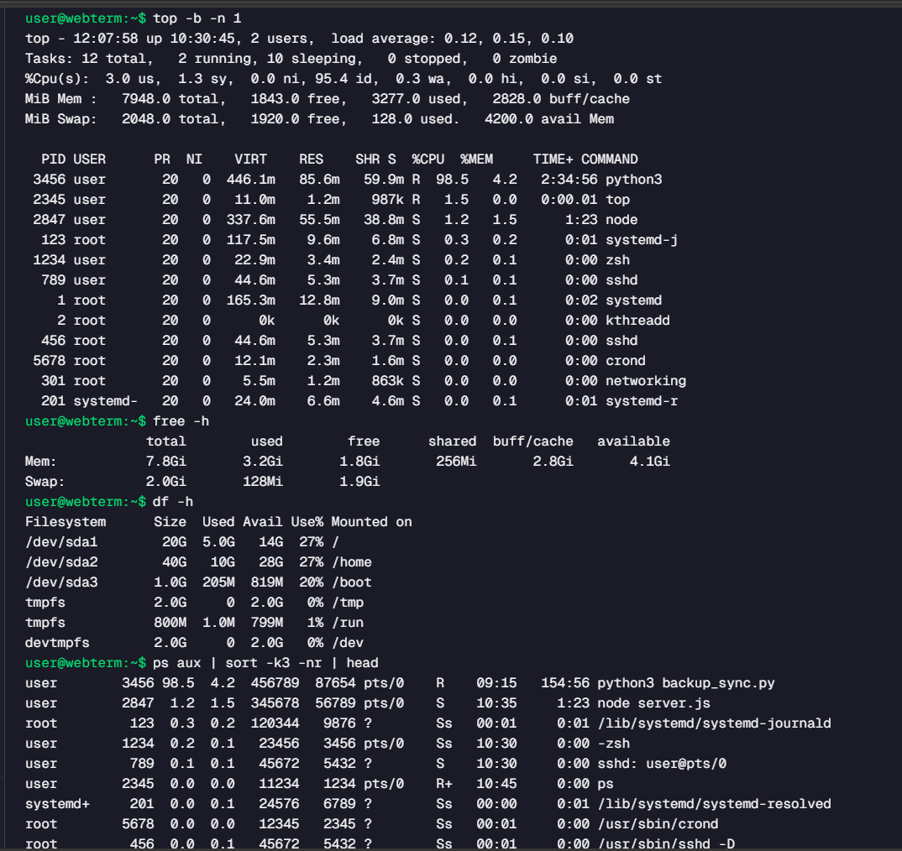

# Q1- A client says the server is slow. What commands would you run to check CPU, memory, disk, and top processes?​

## Solution:
1. Check CPU usage and running processes
2. Check memory usage
3. Check disk space utilization
4. Identify the top resource-consuming processes

## Proof of work:

# Q2- A Python process is consuming high CPU. How would you identify the process, inspect it, and decide whether it is safe to stop?​

Identify the python process 
ps aux | grep python 

Inspect the process
ps -p 1482 -f 

Inspect what the python processor is doing 
lsof -p 1482

Stop the process
kill 1482

Check whether it stopped
ps -p 1482

# Q3- The application is running, but users cannot access port 8080. How would you debug it?​

Check if the application is running
ps -ef | grep app

Check if port 8080 is listening
ss -tulnp | grep 8080

Check application logs
tail -50 app.log

Verify the configured port
cat application.properties

Check if the firewall is blocking 8080
firewall-cmd --list-ports

# Q4- A service keeps restarting. What would you inspect?​
Check service status
systemct1 status payment-api

Check service logs command
journalctl -u payment-api -n 50

Check recent errors 
journalctl -u payment-api -p err -n 20

 
Check restart count
systemctl status payment-api

# Q5- Disk usage suddenly reaches 95%. How would you find what is consuming space without deleting random files?​

Check which directory is using the most space
du -sh /*

Drill down into the large directory
du -sh /var/*

Find large files
find / -type f -size +500M

Check log files
du -sh /var/log/*

# Q6- Memory usage keeps increasing until the process is killed. What would you monitor?​ 

Check memory usage
free -h

Monitor the process memory
top

Monitor a specific process
ps -p 3482 -o pid,%mem,rss,cmd

Check system logs
tail -50 app.log